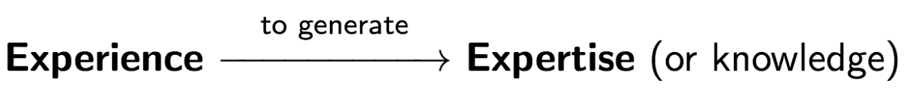
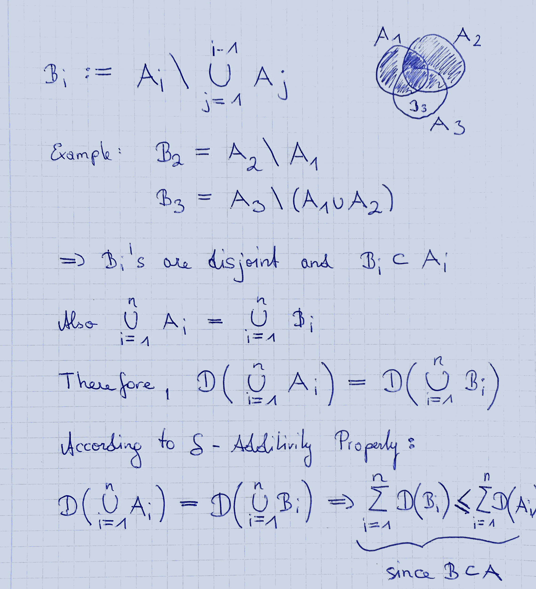

## Introduction

### What is machine learning?

Machine learning can be informally described as the discipline that teaches a machine to use

The quality of a so-called **learner** can be measured by its  
- space/time complexity  
- sample complexity (Guarantees that can be given with respect to the sample size)

If we want to name important properties of a learner, we first have to say that a successful learner it should be **able to generalize**. This property is also called **inductive reasoning** or **inductive inference**.

In practice, the instance space is often so large that any learning algorithm only sees a fraction of it during training. Therefore, we can say that we need to bias the learning process via incorperation of prior knowledge. **Inductive bias** of a learning algorithm is the set of assumptions that the learner uses to predict outputs given inputs that it has not encountered.

### Learning scenarios

Typically, we differentiate between three different types of learning scenarios. These learning scenarios are:

- **Supervised learning**  
  Experience (in the form of training instances) is provided to the learner. Every training instances consists of features and a label / set of labels.
  
- **Unsupervised learning**  
  No distinction between train and test instances. This means that we do not provide labeled instances to the learner. We aim for summary representation (e.g. clustering) of the data.
  
- **Semi-supervised learning**  
  Training data contains both labeled and unlabeled instances. We often encounter this scenario in the field of autonomous driving.  
  **Example:** Gather data --> Label some of them --> Train with labeled data --> Predict labels for the unlabeled data --> Train with the whole dataset 
  
  
Furthermore, there are two other types of scenarios called **active** and **passive** learning.

- **Active learning**  
Active learners interact with the environment at training time. For example, by asking a human for the correct label.  
**Example:** Spam classification. If the classifier requires a human to label the spam manuall.y

- **Passive learning**  
 Passive learners only makes use of information provided to them.
 
 
### Probability review

#### Probability space

A probability space ($\Omega, \mathcal{F}, \mathcal{D}$) is a mathematical construct that models a real-world process (or “experiment”) consisting of states that occur randomly.

A probability space has three components:

- sample space $\Omega$: the set of elementary events
- event set of $\mathcal{F}$ (a $\sigma$-algebra): a set of subsets of sigma
- a propability measure $D$ mapping $\mathcal{F} \rightarrow [0,1]$, such that   
  - $D(\Sigma)$ = 1 and  
  - for all mutually exlusive events $\{A_i\}_{i=1}^n$, $D(\bigcup_i A_i) = \sum_i D(A_i)$

**Example:**

We define the *propability space* $(\Omega_1, \mathcal{F_1}, u)$ and the *measure space* $(\Omega_2, \mathcal{F_2}, u_x)$.

Let's say we have a random variable $X: \Omega_1 \rightarrow \Omega_2$ that is 1 if a dice throw is even, otherwise 0.

$\Omega_1 = \{1,2,3,4,5,6\} \hspace{2cm} \Omega_2 = \{0,1\}$ (0: even; 1: odd)

$\mathcal{F_1} = \mathscr{P}(\Omega_1)$ (power set) $\hspace{2cm} \mathcal{F_2} = \{ \emptyset,\{ 0 \}, \{ 1 \}, \{ 0,1 \} \}$

$u(\{ 1 \}) = ... = u(\{ 6 \}) = \frac{1}{6}$

$u_x(\{ 0\}) = u(x^{-1}(\{ 0 \})) = u(\{ 1,3,5\}) = \frac{1}{2}$

**Note:**  
$x^{-1}$ ... Pre-image -> What took us to {0}?  
A $\sigma$-algebra (also σ-field) on a set X is a collection Σ of subsets of X that includes the empty subset, is closed under complement, and is closed under countable unions and countable intersections. The pair (X, Σ) is called a measur**able** space.

    
#### Random variable (RV)

A random variable U is a function $U : \Omega \rightarrow R$ that is measurable,  
i.e., $\{w : w \in Ω,U(w) \in B\} \in F \hspace{1cm} \forall B \in B(R)$.
 
#### Conditional propability

$D(A|B) = \frac{A \cap B}{B}$

The events are said to be **independent**, if $D(A \cap B) = D(A) \cdot D(B)$.
  
#### Independently and identically distributed (i.i.d.) RVs 
A sequence of RVs $X_1$, . . . , $X_n$ is said to be independently and identically distributed (i.i.d.) when the $X_i$ are (1) mutually independent
and (2) follow the same distribution.

#### Sum rule

$D(A \cup B) = D(A) + D(B) + D(A \cap B)$

#### Union bound

$D(\cup_{i=1}^n A_i) \leq \sum_{i=1}^n D(A_i)$

**Example:**

#### Bayes formula

$D(A|B) = \frac{D(B|A) \cdot D(A)}{D(B)}$

**Chain rule**

$D( \cap_{i=1}^n A_i) = D(A_1) \cdot D(A_2|A_1) \cdot ... \cdot D(A_n | \cap_{i=1}^{n-1} A_i)$

#### Expected value

$\mathbb{E}[X] = \int_{-\infty}^{\infty} x \cdot f(x) \cdot dx$

Or, in the discrete case:

$\mathbb{E}[X] = \sum_{x} x \cdot \mathbb{P}[x]$

#### Concentration inequalities

Concentration inequalities give bounds for a RV to be concentrated around
its mean, or for it to deviate from its mean.

> **Markov inequality**  

> Let Z be a **non-negative** RV, then  

> $\forall a > 0: \mathbb{P}[Z \geq a] \leq \frac{\mathbb{E}[Z]}{a}$

> **Chebychev’s inequality**  
$\forall a > 0: \mathbb{P}[|Z - \mathbb{E}[Z]| \geq a] \leq \frac{\mathbb{V}[Z]}{a^2}$

> **Hoeffding’s inequality**  
$\mathbb{P}[ |\frac{1}{m} \sum_{i=1}^m Z_i - \mu | \geq \epsilon ] \leq 2e^{\frac{-2m \epsilon^2}{(b-a)^2}}$

