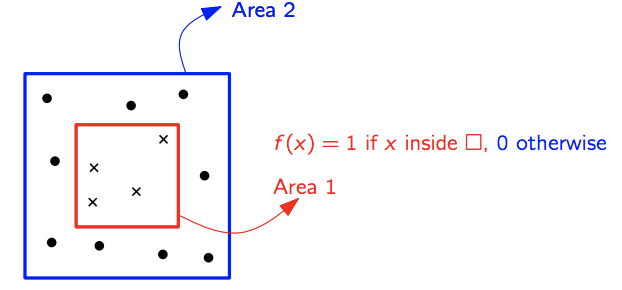

## The learning framework

### Notation

In this lecture we denote by X our **instance space** and by Y our **label space**.  
Typically, instances are represented by a **vector of features**. For example, in our Papaya-Example, possible features are softness and color.

We define *training data* as a finite sequence of instances + label tuples $S=((x_1,y_1), (x_2,y_2), ..., (x_n,y_n))$ with $(x_i,y_i) \in X \times Y$.  
Furthermore, we denote by $S|_x$ the finite sequence of instances. In other words, $S|_x = (x_1, x_2, ..., x_n)$.

### Empirical risk minimizer (ERM)

An ERM is a learner that minimizes the *minimizes the empirical error*. The output of such learner is a **prediction rule** (a.k.a. hypothesis).

$h: X\rightarrow Y$

In other words, if we have a learning algorithm A, then h is the result of running the learning algorithm on the training data S, denoted by A(S).

Formally, a learner A chooses the hypthesis h as follows:

$ERM_H(S) \in \text{arg min}_{h \in H} L_S(h)$

### Generalization error (realizable)

Given a hypothesis h, a true labeling function f and a probability distribution
D over X , the generalization error (or risk) of h is defined as

$L_{D,f} = \mathbb{P}_{x \sim D}[h(x) \neq f(x) ] =  \mathcal{D}( \{ x \in X: h(x) \neq f(x) \}) = \mathbb{E}_{x \sim D}[1_{h(x) \neq f(x)}]$

The generalization error is the probability to predict the wrong label
on a random point drawn from the underlying probability distribution.

We can also say that the generalization error of h is the **expected error based on D**.

**Note:** If we are able to find a hypthesis with $L_{D,f}=0$, we know that it can perfectly classify our data. However, in practice, we won't be able to "calculate" the generalization error since it would require to "see" every feature at least once.

### Empirical error (realizable)

Given a hypothesis h, a true labeling function f and a training sample S, the
empirical error (or empirical risk) of h is defined as

$L_S(h) = \frac{|i \in [m]: h(x_i) \neq f(x_i)|}{m} = \frac{1}{m} \sum_{i=1}^m 1_{h_{x_i} \neq f(x_i)}$

The empirical error of h is the **average error over the sample S**.

### Relationship between generalization and empirical error

We are now going to show that $L_{D,f}(h) = \mathbb{E}[L_S(h)]$.

Intuitively, this is obvious since the generalization error acts as an upper bound for the learners performance. By definition, we can't do better than the generalization error. During training the learner sees only a small subset of instances from the instance space. Based on the training instances it chooses a hypothesis. Obviously, the larger our training space, the better it can choose a hypothesis.

Of course, we can also be shown formally...

**Proof:**

We assume that we have a distribution $D$ that is *independent and identically distributed*.

$\mathbb{E}_{x \sim D^m}[L_S(h)] = \mathbb{E}_{x \sim D^m}[\frac{1}{m} \sum_{i=1}^m 1_{h_{x_i} \neq f(x_i)}]$

Due to *linearity* we can say that:

$\mathbb{E}_{x \sim D^m}[\frac{1}{m} \sum_{i=1}^m 1_{h_{x_i} \neq f(x_i)}] = \frac{1}{m} \sum_{i=1}^m \mathbb{E}_{x \sim D^m}[1_{h_{x_i} \neq f(x_i)}]$

Next, we can make use of the fact that our distribution is i.i.d. and remove the indizes

$\frac{1}{m} \sum_{i=1}^m \mathbb{E}_{x \sim D^m}[1_{h_{x_i} \neq f(x_i)}] = \frac{1}{m} \sum_{i=1}^m \mathbb{E}_{x \sim D^m}[1_{h_{x} \neq f(x)}]$

Finally, we can rewrite it and say...

$\frac{1}{m} \sum_{i=1}^m \mathbb{E}_{x \sim D^m}[1_{h_{x} \neq f(x)}] = \mathbb{E}_{x \sim D^m}[1_{h_{x} \neq f(x)}] \frac{1}{m} \sum_{i=1}^m 1$

$ = \mathbb{E}_{x \sim D^m}[1_{h_{x} \neq f(x)}] = L_{D,f}(x)$

### Overfitting

It might happen that the learner produces a hypothesis that corresponds too closely or exactly to a particular set of training instances and may therefore fail to fit additional instances.

Let's illustrate this by an example:

Let $D$ be such that points are uniformly distributed in the square. Furthermore, our true labeling function is defined as follows:

$f(x) = \begin{cases} 1 \hspace{1cm} \text{if } x \text{ in red rectangle} \\ 
						  0 \hspace{1cm} \text{if } x \text{ outside red rectangle}
		  \end{cases}$

We now provide a set of training instances to the learner and the learner returns a hypothesis as follows:

$h_s(x) = \begin{cases} 
			y_i \hspace{1cm} \text{if } \exists i \in [m] \text{ such that } x_i = x \\ 
			0 \hspace{1cm} \text{ if } \text{else}
		  	\end{cases}$

Clearly, since A is an ERM, $L_S(h_s) = 0$.

However, such a hypothesis is obviously bad since it overfits the data. Basically, we could say that the learner **learned by memorization**.

In fact, the true generalization error is $L_{D,f} = \frac{1}{2}$.

**Why?** We know that our samples are distributed uniformly. As we can see the area marked by the rectangle has the same size as the area of the blue rectangle. Hence, there is a $\frac{1}{2}$ chance that we pick a sample of the red region and classify it wrong.

In general, we can say that...

### Putting bounds on the errors

If we think about overfitting, we will come to the conclusion that's it is a really nasty problem. The fact that it exists tells us that we can never be sure whether an ERM returns a good result or not since the empirical error might not be representative for the quality of our hypothesis.

However, we still can try to put some bounds on this problem.

First, we start by making our life easy by making a few assumptions. We assume that...

- H is a *finite hypothesis class* and every ERM hypothesis $h_s \in \text{arg min}_{h \in H} L_S(h)$.
- $D$ is **realizable**.  
  This means that $\exists h^* \in H$, such that $L_{D,f}(h^*) = 0$ with probility 1 over all random samples S from $D$. Hence, $L_s(h^*) = 0$.

Of course, both assumptions are strong. On the one hand, in real-world problems we usually have to deal with hypothesis classes that are infinite. On the other hand, distributions are often not realizable. This means that there is no perfect solution to a problem.

#### Claim 1: We can only be approximately correct. 

Due to our assumption we know for sure that $L_{D,f}=0$ exists. However, the question that remains is whether we can find such an $h_S$ or not.

**Unfortunately, we are not guaranteed to find such an $h_S$.** 

**Proof:**

Let X be $\{x_1, x_2\}$ a RV and $D(\{x_1\})=1-\epsilon$.  
Therefore, it's obvious that $D(\{x_2\})=\epsilon$.

We know want to draw m samples. Hence, the propability of **not** seeing $x_2$ among m i.i.d. samples is $(1-\epsilon)^m \approx e^{-\epsilon m} $.  
So, if $\epsilon << \frac{1}{m}$ there is almost no chance of not seeing seeing $x_2$ among the samples.

At this point we should come up with an important relationship we will often need later on:

> $1-\epsilon \leq e^{-\epsilon m}$
> 
> **Proof:** Let $f(x)= e^{−x}−(1−x)$. Then $f'(x)=-e^{-x}+1$. This is 0 at x=0, negative if x<0, and positive for x>0.  
> So f(x) reaches an absolute minimum at x=0. The minimum value is 0, so $f(x) \geq 0$ for all x.

#### Claim 2: We can’t guarantee $L_{D,f}(h_S) \leq \epsilon$  with certainty.

We can now try to relax our last claim by excepting a certain amount of error $\epsilon$. The question that remains is whether we can guarantee that $L_{D,f}(h_S) \leq \epsilon$.

The answer is **NO**!

**Why?** There is always a probability that S is not representative of $D$.

But, ...  
we can bound the probability to sample a m-tuple of training instances such that the learner fails.

**Formally, this means that we want to bound  
$D^m(\{ S|_x: L_{D,f}(h_S) > \epsilon \})$.**

### PAC (Probably approximately correct) learning of finite hypothesis classes H

We are now going to apply what we've just learned by putting a bound on the finite hypothesis classes H.

First, let's define two sets.

The set of of **bad hypotheses**. The learner fails on those hypotheses).

$H_{Bad} = \{ h \in H: L_{D,f}(h) > \epsilon \}$

The set of **misleading samples**. The samples for which the ERM returns a hypothesis with $L_s(h) = 0$, but $L_{D,f}(h) > \epsilon$.  
In other words, ...

$M = \{ S|_x: \exists h \in H_{Bad} \text{ and } L_S(h) = 0 \}$

Furthermore, we assume that the distribution $D$ is realizable.

**Proof:**

In our proof we want to bound the propability of picking m samples that give us a hypothesis with $L_{D,f}(h_S) > \epsilon$.  

**(1) Apply realizability assumption**

As we assume realizability, we know that for every ERM hypothesis $L_S(h_S) = 0$.  
The case that $L_{D,f}(h) > \epsilon$ can only happen if $h \in H_{Bad}$ and $L_S(h) = 0$.

$\{S|_x: L_{D,f} > \epsilon\} \subseteq \{ S|_x: \exists h \in H_{Bad} \text{ and } L_S(h) = 0 \} = \cup_{h \in H_{Bad}} \{ S|_x: L_S(h) = 0 \}$

**Why?** Consider the instance space $D$. Furthermore, let's assume $h_1, h_2, ..., h_n$ are hypotheses returned by our ERM based on a sample set $S$. Now, let's take a closer look on these sample sets. Let's assume our ERM returns $h_1$ for a given set of input samples $S_1$, $h_2$ for a given set of input samples $S_2$, etc. Consequently, the sample space returning $h_1$ is a subset of the sample space that returns $h_1$ or $h_2$.

**(2) Apply the union bound**

$D^m(\{S|_x: L_{D,f} > \epsilon\}) \leq D^m(\cup_{h \in H_{Bad}} \{ S|_x: L_S(h) = 0 \}) \leq \sum_{h \in H_{Bad}} D^m(\{ S|_x: L_S(h) = 0 \})$

**(3) Bound right hand side (Use def. of empirical error)**

$\{ S|_x: L_S(h) = 0 \} = \{ S|_x: \forall i: h(x_i) = f(x_i) \}$

**(4) Use i.i.d. assumption**

$D^m(\{ S|_x: \forall i: h(x_i) = f(x_i) \}) = D(...) \cdot ... \cdot D(...) = \prod_{i=1}^m D(\{ S|_x: \forall i: h(x_i) = f(x_i) \})$

$ = \prod_{i=1}^m [1 - L_{D,f}(h) ]$

**(5) Assume $L_{D,f}(h) > \epsilon$**

Since we consider the case where $L_{D,f}(h) > \epsilon$ we can conclude that:

$1 - L_{D,f}(h) \leq 1 - \epsilon$

Hence, ...

$\prod_{i=1}^m 1 - L_{D,f}(h) \leq \prod_{i=1}^m (1 - \epsilon) = (1-e)^m \leq e^{-\epsilon m}$

**(6) Combine (5) with (2)**

$D^m(\{S|_x: L_{D,f} > \epsilon\}) \leq \sum_{h \in H_{Bad}} D^m(\{ S|_x: L_S(h) = 0 \})$

$ \leq \sum_{h \in H_{Bad}} e^{-\epsilon m} = |H_{Bad}| \cdot e^{-\epsilon m} \leq |H| \cdot e^{-\epsilon m}$

**(7) Bound m**

$|H| \cdot e^{-\epsilon m} < \delta$

$ln(|H|) - \epsilon m < ln(\delta)$

$- \epsilon m < ln(\delta) - ln(|H|)$

$m \geq \frac{-ln(\delta) + ln(|H|)}{\epsilon}$

$m \geq \frac{ln(|H| / \delta)}{\epsilon}$

We've just derived our first import corollary!

> **PAC learning of finite hypothesis classes H**
> 
> Fix $\epsilon$, $\delta \in (0, 1)$.  
> If $m \geq \frac{log(|H|/\delta)}{\epsilon}$, then for any D, f (assuming
realizability), with probability $1 − \delta$ (over the choice of S of size m), we have (for every ERM hypothesis $h_S$)  
> $\hspace{8cm} L_{D,f}(h_S) \leq \epsilon$

### PAC Learning
We've just shown that finite hypothesis classes are PAC-learnable. However, we still lack a formal definition of PAC learnability. Therefore, let's define it now!

> **PAC learnability**
> 
> A hypothesis class H is PAC learnable if $\exists m_H: (0,1)^2 \rightarrow N$ and a learning algorithm A with the following property: 
> 
> For   
> - every $\delta \in (0,1)$  
> - every distribution D over X  
> - every label function $f: X \rightarrow Y$  
> 
> if realizability holds w.r.t. H, D, f , then running A on $m \geq m_H(\epsilon, \delta)$ labeled (by f ) i.i.d. samples of D, A returns a hypothesis h with
probability $1 − \delta$  
> $\hspace{8cm}L_{D,f}(h) \leq \epsilon$.

### Agnostic PAC learning

Unfortunately, to show PAC learnability we have to make many and also really strong assumptions.  However, we can try to relax it a little bit and obtain what is called **agnostic PAC learnability**.

For agnostic PAC learnablity we take our PAC learnability and **drop the realizability assumption**.

What does this mean? Well, it means that we can't guarantee that a sample drawn from our distribution $D$ is assignable to a *unique* label. Consequently, we also can't guarantee that there exists a perfect labeling function $f$ since our dataset is not perfectly separable.

Hence, we need to redefine a few things to fit in the context of agnostic PAC learnability.

First, we say that $D$ is now a propability distribution over $X \times Y$.

Second, we need to redefine the generalization error / empirical error to fit to our new distribution.

### Generalization error (non-realizable)

$L_{D}(h) = \mathbb{P}_{(x,y) \sim D}[h(x) \neq y] = D(\{(x,y) \in X \times Y: h(x) \neq y\})$

### Empirical error (non-realizable)

$L_{S}(h) = \frac{|i \in [m]: h(x_i) \neq y_i|}{m}$

### General loss function

The generalization / empirical error we used so far only works for classification problems. Once we have to deal with regression problems we need another type of error measure.  
Fortunately, we can rewrite our error functions in a way that they are indepent of the problem-specific error function.

We therefore define a so-called **loss-function $l$**. 

> Given a hypothesis class H and some domain Z, the function
> 
> $l: H \times Z \rightarrow \mathbb{R}$
> 
> is called a loss function.

### Generalization error (general)

$L_{D}(h) = \mathbb{E}_{Z \sim D}[l(h,z)]$

### Empirical error (general)

$L_{D}(h) = \frac{1}{m} \sum_{i=1}^m l(h,z_i)$

**Example:**

- **0-1 loss**  
  $l_{0-1}(h,(x,y)) = 1_{h(x) \neq y}$

- **Squared loss**  
  $l_{sq}(h,(x,y)) = (h(x) - y)^2$
