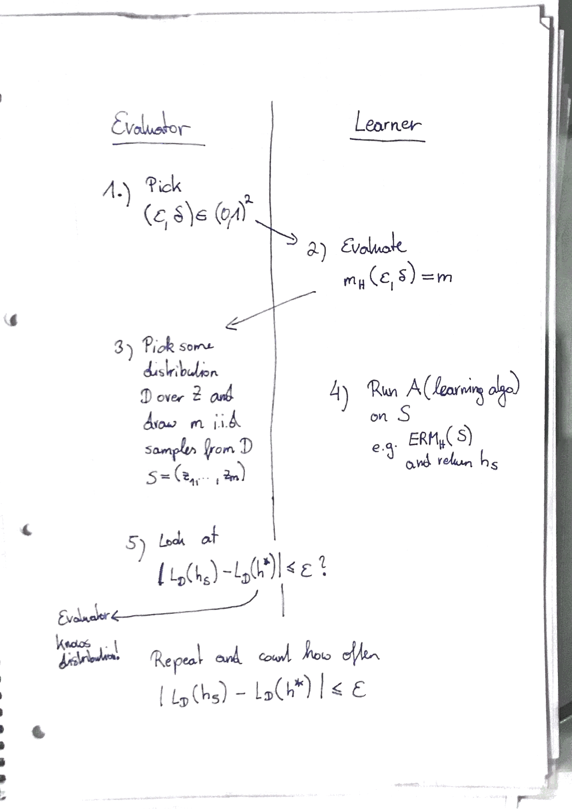

## Learning via uniform convergence

Our main goal in this section is to show that finite hypothesis classes are *agnostic* PAC learnable. In other words, we want to show the the problem PAC learnable even without assuming realizability.

Therefore, we are going to show PAC learnability converges uniformly.

### PAC learnability as game

Before we start with our proof, we are going to look at PAC learnability as a little game between an "evaluator" and a "learner". 

**Evaluator**:  
- Chooses $\epsilon$ and $\delta$  
- Draws $m_H$ samples from a random distribution  
- Assesses the quality of the hypthesis $h_S$

**Learner:**  
- Provides the number of samples $m_H$ to the evaluator  
- Executes the learning algorithm A and returns a hypothesis ($H_S$)  

1. The evaluator chooses $\epsilon$ and $\delta$ and asks the learner "Hey, I'm sure you can't give me a good hypothesis for $\epsilon$ and $\delta$.  
2. The learner replies "Yes, I'm sure I can! Just give me $m$ samples and I will do it for you no matter which data you give me!"
3. The evaluator draws $m$ samples from a random distribution and provides it to the learner.
4. The learner runs its algorithm A on the data and returns a hypothesis $h_S$ to the evaluator.
5. The evaluator compares the generalization error of $h_S$ to $h*$. If there are close to each other ($\leq \epsilon$), we say that the learner wins. Otherwise, the evaluator wins.

We then repeat step 1. - 5. and evaluate how often the learner was right. If turns out that the overall failure propability is more than $\delta$, the learner has to be considered as a bad one.

### $\epsilon$ - representativeness

We will now come up with a new definition called $\epsilon$-representativeness that is going to help us to show that agnostic PAC learning works for finite hypothesis classes.

An $\epsilon$-representative sample is defined as follows:

> **$\epsilon$-representative**
> 
> A training set S is called $\epsilon$-representative w.r.t. H, D and l if
> 
> $\forall h \in H: | L_S(h) - L_D(h) | \leq \epsilon$

Now, let's think about what it actual means. If S is indeed representative of H w.r.t. D then $ERM_H$ is a good learning strategy.

Based on that we now going to derive another lemma.

> Assume that S is $\epsilon/2$-representative.  
> 
> Then, any output $h_S \in $ arg min$_{h \in H} L_S(h)$ of an ERM algorithm satisfies 
> 
> $L_D(h_S) \leq $ min$_{h \in H} L_D(h) + \epsilon$

**Proof:**

(1) Let's assume our sample S is $\epsilon$-representative.  
In other words, the following definition holds for S.

$\forall h \in H: | L_S(h_S) - L_D(h_S) | \leq \epsilon$ 

Or in other words, ...

$L_D(h_S) \leq L_S(h_S) + \epsilon $ 

(2) We know that $H_S$ is the output of our ERM$_H$. And what is the output of our imperical risk minimizer? Well, let's recall what the ERM minimizes...

arg min$_{h \in H} L_S(h)$ --> ERM returns the hypothesis with the minimum empirical error

Therefore, we can write:

$L_D(h_S) \leq $ arg min$_{h \in H} L_S(h) + \epsilon $ 

(3) Again, we can apply our $\epsilon$-representative definition for S

$L_D(h_S) \leq $ arg min$_{h \in H} L_D(h) + \epsilon + \epsilon $ 

$L_D(h_S) \leq $ arg min$_{h \in H} L_D(h) + 2 \epsilon$ 

**What we've got is pretty a cool thing since it tells as that if we have a sample set that is $\epsilon$ - representative, we can be sure that the outcome of our ERM-algo is at least the loss w.r.t. the best hypothesis + $2 \cdot \epsilon$.**

The question that remains is how we can make sure that we find a set that's $\epsilon$ - representative.

### Uniform convergence

We've just learned that once a set is $\epsilon$ - representative, we can be sure that an ERM can solve our problem successfully. The question that remains is how many samples we need to be $\epsilon$ - representative.  
This is what we are going to proof now.

> **Uniform convergence**
> 
> A hypothesis class H has the uniform convergence property if
> 
> $\exists m_H^{UC}: (0,1)^2 \rightarrow N$
> 
> such that for  
> - every $\epsilon$, $\delta \in (0,1)$, and  
> - every probability distribution D over Z and loss l
> 
> the following holds:
> 
> if S is an i.i.d. sample of size $m \geq m_H^{UC}(\epsilon, \delta)$ then,
> then, with probability $1-\delta$, the sample S is $\epsilon$ - representative.

**Proof:**

(1) We start by fixing $\epsilon$, $\delta$. We need to show that

$D^m(\{ S: \forall h \in H, | L_S(h) − L_D(h)| \leq \epsilon \}) \geq 1 - \delta$

(2) We can also rewrite this as ...

$D^m(\{ S: \exists h \in H, | L_S(h) − L_D(h)| > \epsilon \}) <  \delta$

(3) Apply the union bound on (2)

$D^m(\{ S: \exists h \in H, | L_S(h) − L_D(h)| > \epsilon \}) \leq \sum_{h \in H} D^m(\{ S: | L_S(h) − L_D(h)| > \epsilon \})$

(4) Replace $L_S(h)$ by the definition of the empirical error

Let's recall how our $L_S(h)$ is defined in the realizable case.

$L_S(h) = \frac{1}{m} \sum_{i=1}^m l(h,z_i)$

If we "plug" this into our formula, we get ...

$\sum_{h \in H} D^m(\{ S: | L_S(h) − L_D(h)| > \epsilon \}) = \sum_{h \in H} D^m(\{ S: | \frac{1}{m} \sum_{i=1}^m l(h,z_i) − L_D(h)| > \epsilon \})$

(5) Doesn't this look a little bit like the Hoeffding's inequality? Well, indeed. So, let's use Hoeffding's inequality to bound it.

> **Hoeffding’s inequality**
> 
> - Let $Z_1$, ..., $Z_m$ be a sequence of m i.i.d. RV's  
> - $\overline{Z} = 1/m \sum_i Z_i$ (i.e. empirical average)  
> - $\mathbb{E}[\overline{Z}] = \mu$  
> - $\forall i: \mathbb{P}[a \leq Z_i \leq b] = 1$
> 
> $\mathbb{P}[ |\frac{1}{m} \sum_{i=1}^m Z_i - \mu | \geq \epsilon ] \leq 2e^{\frac{-2m \epsilon^2}{(b-a)^2}}$

$\sum_{h \in H} D^m(\{ S: | \frac{1}{m} \sum_{i=1}^m l(h,z_i) − L_D(h)| > \epsilon \}) \leq 2e^{\frac{-2m \epsilon^2}{(b-a)^2}}$

Wait, it's not that easy since the "stuff" we substitute for $\mu$ needs to be the expected value of the empirical average of our loss function. Therefore, let's take a closer look at $L_D(h)$.

As we know $L_D(h)$ is defined as: $L_D(h) = \mathbb{E}_{x \sim D}[l(h,z)]$  

We now start to calculate the expected value of the empirical average of $L_S(h)$.

$\mathbb{E}_{x \sim D^m}[\frac{1}{m} \sum_{i} l(h,z_i)]$

$\mathbb{E}_{x \sim D^m}[\frac{1}{m} \sum_{i} l(h,z_i)] = \frac{1}{m} \sum_{i} \mathbb{E}_{x \sim D} [l(h,z_i)] \hspace{1cm}$ (linearity of expectation)

$\frac{1}{m} \sum_{i} \mathbb{E}_{x \sim D} [l(h,z_i)] = \frac{1}{m} \sum_{i} \mathbb{E}_{x \sim D} [l(h,z)] \hspace{1cm}$ (i.i.d.)

$\frac{1}{m} \sum_{i} \mathbb{E}_{x \sim D} [l(h,z)] = \frac{1}{m} \cdot m \cdot \mathbb{E}_{x \sim D} [l(h,z)]$

$\frac{1}{m} \cdot m \cdot \mathbb{E}_{x \sim D} [l(h,z)] = L_D(h)$

Well, so we can substitute $L_D(h)$ for $\mu$. But what about a and b?  
a and b is the upper and lower limit of our loss function. In our case, a = 0 and b = 1.

Therefore, we get:

$\sum_{h \in H} D^m(\{ S: | \frac{1}{m} \sum_{i=1}^m l(h,z_i) − L_D(h)| > \epsilon \}) \leq \sum_{h \in H} 2e^{-2m \epsilon^2}$

(7) Since we assume that we know the size of H ...

$\sum_{h \in H} D^m(\{ S: | \frac{1}{m} \sum_{i=1}^m l(h,z_i) − L_D(h)| > \epsilon \}) \leq 2 |H| e^{-2m \epsilon^2}$

(6) Finally, we bound this by our $\delta$ and rearrange it to get our final equation.

$2 |H| e^{-2m \epsilon^2} \leq \delta$

$m_H^{UC} \geq \frac{log(2 |H| / \delta)}{2 \epsilon }$

 