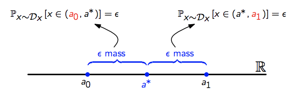

## Vapnik-Chervonenkis (VC) Dimension

So far, we have learned that ...

- finite classes are PAC learnable
- finite classes are agnostic PAC learnable
- uniform convergence

The question that remains is whether we can say anything about infinite hypothesis classes ($|H| = \infty$).

### Class of threshold functions is PAC learnable

As an introduction into the topic of finite hypothesis classes we take a look at the hypothesis class of threshold functions. We are going to show that this class is PAC learnable despite of the fact that is $|H| = \infty$.

> **Class of threshold functions is PAC learnable**
> 
> Let H be the hypothesis class of threshold functions.
> 
> $H = \{ h_a: a \in \mathbb{R} \}$ with $h_a(x) = \begin{cases} 1 & \text{if } x < a \\ 0 & \text{else} \end{cases}$
> 
> Then H is PAC-learnable with "sample complexity" $m_H(\epsilon, \delta) \leq \big{\lceil} \frac{log(2/\delta)}{\epsilon} \big{\rceil}$.

**Proof:**

We start by fixing some value $a^*$ such that $h^*(x) = 1$ and $L_{D,f}(h^*) = 0$.  
Further, we define $a_0$ and $a_1$ such that:

We now consider a set of training samples S = (($x_0$,1),($x_1$,1),($x_2$,0), ...).  
Based on this training sample S we are now looking for values $b_0$ and $b_1$.

These values are defined as follows:

$b_0 = max_x \{ (x,1), x \in S|x \}$  
$b_1 = min_x \{ (x,0), x \in S|x \}$

Running our ERM$_H$ will return a hypothesis $h_S$ with threshold $M(b_0,b_1)$.  
For $L_{D,f}(h_S) \leq \epsilon$ we need need $b_0 \geq a_0$ and $b_1 \leq a_1$.  

Furthermore, we have:  
$\mathbb{P}_{S \sim D_x^m}[L_{D,f}(H_S) > \epsilon] \leq \mathbb{P}_{S \sim D_x^m}[(b_0 < a_0) \text{ or } (b_1 > a_1)] \leq \mathbb{P}_{S \sim D_x^m}[b_0 < a_0] + \mathbb{P}_{S \sim D_x^m}[b_1 > a_1]$

$\mathbb{P}_{S \sim D_x^m}[b_0 < a_0] = (1-\epsilon)^m \leq e^{-\epsilon m}$

Now, try to bound this by $\delta / 2$.

$(1-\epsilon)^m \leq e^{-\epsilon m} \leq \frac{\delta}{2}$

Hence, we get: $m > \frac{log(2/\delta)}{\epsilon}$ 

If we now do the same for $\mathbb{P}_{S \sim D_x^m}[b_1 > a_1]$ we can finally write:

$\mathbb{P}_{S \sim D_x^m}[L_{D,f}(H_S)] \leq \mathbb{P}_{S \sim D_x^m}[b_0 < a_0] + \mathbb{P}_{S \sim D_x^m}[b_1 > a_1] \leq \frac{\delta}{2} + \frac{\delta}{2} \leq \delta$

### Shattering

> **Restricting H to C**
> 
> Let H be a hypothesis class of functions from X to {0, 1} and C = { $c_1$, $c_2$, ..., $c_m$ } $\subset$ X.  
> By restricting H to C, denoted by $H_C$ , we mean
> 
> $H_C = \{ (h(c_1), h(c_2), ..., h(c_m)): h \in H \}$

> **Shattering**
> 
> A hypothesis class H shatters a set C if $|H_C|$ = $2^{|C|}$  
> i.e., it comprises all functions from C to {0, 1}.

**Example:**

To get a better understanding of "shattering" we will now try to figure out whether the class of threshold functions can be shattered.

$H = \{ h_a: a \in \mathbb{R} \}$ with $h_a(x) = \begin{cases} 1 & \text{if } x < a \\ 0 & \text{else} \end{cases}$

- **Does H shatter $C=\{c_1\}$?**  

  First, new need to compute $H_C$:
  
  $H_C = \{ (h(c_1)): h \in H \} = \{ (0), (1) \}$
  
  Hence, we get:
  
  $|H_C| = 2^{|C|} <=> 2 = 2^{1}$ $\rightarrow$ H shatters $\{c_1\}$
  
- **Does H shatter $C=\{c_1, c_2\}$ where $c_1 \leq c_2$?**

  $H_C = \{ (h(c_1), h(c_2)): h \in H \} = \{ (0,0), (0,1), (1,1) \}$
  
  **Note:** (1,0) is not possible since $c_1 \leq c_2$.
  
  Hence, ...
  
  $|H_C| = 2^{|C|} <=> 3 \neq 2^{2}$ $\rightarrow$ H doesn't shatter $\{c_1, c_2\}$
  
### VC-Dim

> **VC-Dim**
> 
> The VC-Dimension of a hypothesis class H is denoted by VCdim(H).  
> VCdim(H) is the largest integer d, such that there exists a set of size d that is shattered by H.

Or in other words, ...

> **VC-Dim**
> 
> **Lower bound:**  
> There exits a set of size d that is shattered: VC(H) = d
> 
> **Upper bound:**  
> No set of set d+1 is shattered  VC(H) < d+1
>

**Proof:**  
Show that finite VC-Dimension implies uniform convergence. Skipping proof for now since this one is quite tough.

**Examples:**

- **Threshold functions**  
  
  The $VCdim(H_{Thres})=1$ since $H_{Thres}$ shatters $\{c_1\}$, but not $\{c_1,c_2\}$.  See example above.
  
- **Intervals**  

  Let's look at the classes of intervals: $H_{Int} = \{ h_{a,b}(x): a \leq b, \hspace{0.5cm} a,b \in \mathbb{R}\}$.
  
  $h_{a,b} = \begin{cases} 1 & \text{if } x \in (a,b) \\ 0 & else \end{cases}$
  
  **Does H shatter $\{c_1\}$?**  
  Obviously true.
  
  **Does H shatter $\{c_1,c_2\}$?**  
  Yes.
  
  **Does H shatter $\{c_1,c_2,c_3\}$?**  
  No, since the output $\{(1,0,1)\}$ is not possible.
  
  Therefore, the $VCdim(H_{Int})) = 2$.

- **Axis aligned rectangles**

  Let $H_{Rect} = h(a_1,a_2,b_1,b_2) = \begin{cases} 1 & \text{if } a_1 \leq x_1 \leq a_2 \text{ and } b_1 \leq x_1 \leq b_2 \\ 0 & \text{}  \end{cases}$

  **Does H shatter $\{c_1\}$?**  
  Yes, that's obvious.
  
  **Does H shatter $\{c_1,c_2\}$?**  
  Yes
  
  **Does H shatter $\{c_1,c_2,c_3\}$?**    
  Yes
  
  **Does H shatter $\{c_1,c_2,c_3,c_4\}$?**    
  Yes
  
  **Note:** It's enough to find *at least one* possible constellation of points $(x_1,x_2)$  where H shatters C successfully since we always look for the max $H_C$.
  
  **Does H shatter $\{c_1,c_2,c_3,c_4,c_5\}$?** 
  
  No, since there's always a point enclosed by the other points. If we tried to label this one with 0 and the other ones with 1, we would fail. (convex hull argument?)
  
  Therefore, the $VCdim(H_{Rect}) = 4$.
  
- **Union of a finite number of intervals on the line**

 For any set of points we could cover the positive points by choosing the
intervals small enough.

 $VCdim(H) = \infty$

- **Concentric circle**  

  $VCdim(H) = 1$

- **Circles**  

  $VCdim(H) = 3$
  
  
> **Corollary**
> 
> Let H be a hypothesis class of functions from X to {0, 1}. Assume
there exists a set C $\subset$ X of size 2m that is shattered by H. Then for
any learning algorithm A, there exists a distribution D over X $\times$ {0, 1}
and h $\in$ H such that $L_D(h) = 0$, but with probability of 1/7 over
the choice of $S \sim D_m$, we have $LD(A(S)) \sim 1/8$.

      
   
> **VCdim(H)=$\infty$ implies that H is not PAC learnable**
>
> Let H be such that VCdim(H) = $\infty$. Then H is not PAC learnable.
> 
> **Proof:**
> 
> Since H has an infinite VC-dimension, for any training set size m, there exists a shattered set of size 2m, and the claim follows from the corollary above.
> 
> 
> 
> **If $|H|$ is finite, also the VCdim($|H|$) is finite**
> 
> **Proof:**
> 
> Let's consider a set $|H|$ that is finite.  
> 
> For any set C, restricting H to C implies that: $\hspace{1cm} |H_C| \leq |H|$
> 
> If H does not shatter $H_c$, we have: $|H_C| < 2^{|C|}$  
> If H shatters $H_c$, we have: $|H_C| = 2^{|C|}$.
> 
> Therefore, we can say that:
> 
> $|H_C| \leq 2^{|C|} \leq |H| \rightarrow |C| \leq log(|H|)$
> 
> Since this needs to hold for any C it also needs to hold for max $|C|$.
> 
> Therefore, we can say that $VCdim(H) \leq log(|H|)$.

Finally, some other theorems which might come in handy:

> **Growth function**
> 
> Let H be a hypothesis class. Then the growth function of H, denoted by $\tau_H: N \rightarrow N$, is defined as
> 
> $\tau_H(m) = max_{C \subset X: |C| = m} |H_C|$

