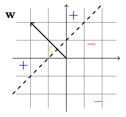
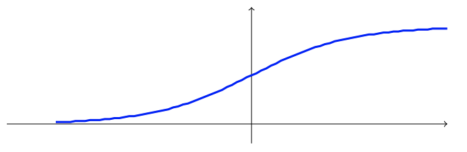
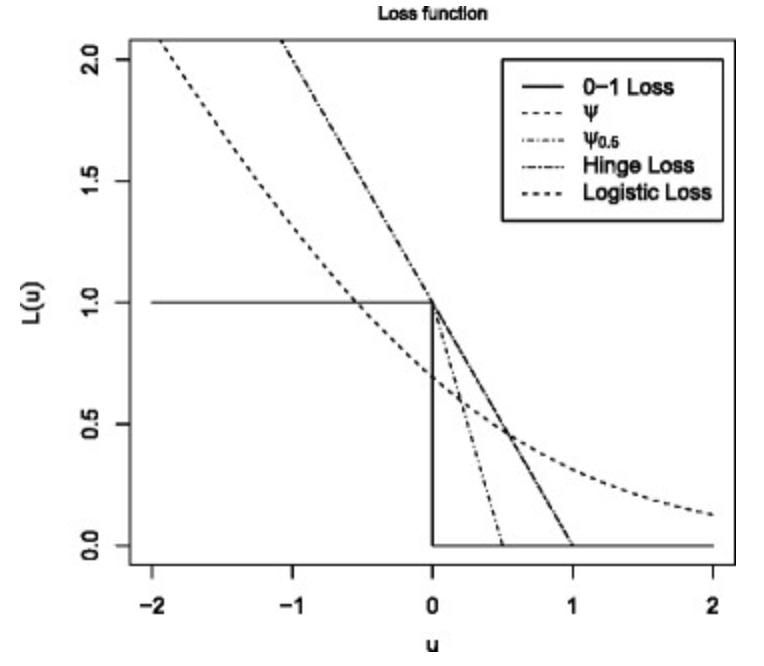

## Linear predictors

Linear predictors are one of the most used families of hypothesis classes. Many learning algorithms that are being widely used in practice rely on linear predictors, first and foremost because of the ability to learn them efficiently in many cases. In addition, linear predictors are intuitive, are easy to interpret, and fit the data reasonably well in many natural learning problems.

### Affine functions

The class of affine functions is defined as follows:

$L_d = \{ h_{w,b}: w \in \mathbb{R}^d, b \in \mathbb{R} \}$

with 

$h_{w,b}: \mathbb{R}^d \rightarrow \mathbb{R}, \hspace{0.3cm} x \rightarrow <w,x> + b$

be the class of **affine functions**.

**Note:**

We call b the bias. Also, by extending $x \in R^d$ to

$x' = (1, x_1, ..., x_d) \in R^{d+1}$

and letting 

$w' = (b, w_1, ..., w_d) \in R^{d+1}$

we can write 

$<w,x> + b = <w',x'>$

If we use this notation, we get the class of homogeneous linear functions.

### Linear predictors

The classes of linear predictors are compositions of functions:

$\phi: \mathbb{R} \rightarrow Y$

on $L_d$.

For classification problems: $\phi = sign$  
For regression problems: $\phi = id$  

### Halfspaces

The first hypothesis class we consider is the class of halfspaces, designed for binary classification problems, namely $X = \mathbb{R}^d$ and $Y = \{ -1, 1\}$.

The class of halfspaces is defined as follows:

$HS_d = \text{sign } \cdot L_d = \{ x \rightarrow sign(h_{w,b}(x)): h_{w,b} \in L_d \}$

### ERM for halfspaces in the realizable case w.r.t. 0-1 loss

**Note:** In the non-realizable case it is computationally hard

Let $S=\{(x_i,y_i)\}_{i=1}^m$ be our set of training instances.

We know that ERM hypothesis in the realizable case 0 empirical error.

**Goal:** Find $w \in \mathbb{R}^d$ for which $sign(<w,x>) = y_i$.

In other words $y_i \cdot <w,x> = 0 \hspace{0.5cm} \forall i \in \{ 1,..., m \}$.  
Due to realizability we know that $\exists w^* \in \mathbb{R}^d$ which achieves 0 empirical error and also 0 generalization error.

We know define $\mu = min_i(y_i \cdot <w^*,x_i>)$.

Now, let $\bar{w} = \frac{w^*}{\mu}$.

Therefore, for all i we have: 

$y_i \cdot <\bar{w}, x_i> = y_i \cdot < \frac{w^*}{\mu},x_i> = \frac{1}{\mu} \cdot y_i <w^*,x_i>$

Since $y_i \cdot <w^*,x_i> \geq 1$ we can say that:

$\frac{1}{\mu} \cdot y_i <w^*,x_i> \geq 1$

In other words, we know that there exists a vector $w \in R^d$ with $y_i <w,x_i> \geq 1 \hspace{0.5cm} \forall i \in \{1,...,n \}$ 

We can also express our inequality constraint in the form $Aw \geq V$.

### Linear program

Linear programs (LP) are problems that can be expressed as maximizing a linear function subject to linear inequalities. That is,

> **Linear program**
> 
> $max_{w \in \mathbb{R}^d} <w,u>$ s.t.

> subject to $Aw \geq V$ with $u \in \mathbb{R}^d$, $v \in \mathbb{R}^d$ 

In our case just set u to the dummy vector of all 1's. $u=(1,...,1)^T$

### VC-Dim of halfspace classifiers

Skipping proof.

### Logistic regression

In logistic regression we learn a family of functions h from $\mathbb{R}^d$ to the interval [0, 1]. However, logistic regression is used for classification tasks: We can interpret h(x) as the probability that the label of x is 1. The hypothesis class associated with
logistic regression is the composition of a sigmoid function $\phi_{sig}: \mathbb{R} \rightarrow [0, 1]$ over the class of linear functions $L_d$. In particular, the sigmoid function used in logistic regression is the logistic function, defined as

$\phi_{sig} = \frac{1}{1 + e^{-x}}$

The name "sigmoid" means "s-shaped", referring to the plot of this function.

**Remark:**

- If $<w,x>$ is large --> $\phi$ close to 1
- If $w,x>$ is small --> $\phi$ close to 0

### Cross-entropy

$h_w \in H_{sig}$: Think of this as $\mathbb{P}[y=1|x,w] = h_w(x) = \phi_{sig}(<w,x>)$.

$\mathbb{P}[y=1|x,w] = 1 - h_w(x) = 1 - \phi_{sig}(<w,x>)$

We can write this as $\mathbb{P}[y|x,w]$.

$\mathbb{P}[y|x,w] = (\phi_{sig}(<w,x>))^y \cdot (1 - \phi_{sig}(<w,x>))^{1-y}$ (Bernoulli distribution)

As we assume that $x_i$ is i.i.d. and we have $x_1, ..., x_m$.

$\mathbb{P}[(y_1,...y_m)|X,w] = \prod_{i=1}^m((h_w(x_i))^{y_i} \cdot (1-h_w(x_i))^{1-y_i}$

Taking the log gives us:

$log(\mathbb{P}[(y_1,...y_m)|X,w]) = log(\prod_{i=1}^m(h_w(x_i))^{y_i} \cdot (1-h_w(x_i))^{1-y_i}) = \sum_{i=1}^m y_i \cdot log (h_w(x_i)) + \sum_{i=1}^m (1-y_i) \cdot log (1- h_w(x_i))$ 

--> This is also called **cross-entropy**.

### Negative Log-Likelihood

Let's assume $y_i \in \{ 1, -1\}$.

$\mathbb{P}[y=1|x,w]) = \phi_{sig}(<w,x>) = \frac{1}{1+e^{-<w,x>}}$

$\mathbb{P}[y=-1|x,w]) = 1- \phi_{sig}(<w,x>) = 1 - \frac{1}{1+e^{-<w,x>}} = \frac{1+e^{-<w,x>} - 1}{1+e^{-<w,x>}} = \frac{e^{-<w,x>}}{1+e^{-<w,x>}} = \frac{e^{-<w,x>}}{(e^{-<w,x>})(1+e^{<w,x>})} =  \frac{1}{1+e^{<w,x>}}$

Hence, we coud also say that :

$\mathbb{P}[y|x,w]) = \frac{1}{1+e^{ -y <w,x>}}$

Respectively, ...

$\mathbb{P}[(y_1,...,y_m)|x,w]) = \sum_{i=1}^m log(\frac{1}{1+e^{ -y <w,x>}})$

$\sum_{i=1}^m log(\frac{1}{1+e^{ -y <w,x>}}) = - \sum_{i=1}^m log(1+e^{ -y <w,x>})$

This is also called the **log-likelihood**.

To turn the problem into a minimization problem we simply add a minus.

$- \mathbb{P}[(y_1,...,y_m)|x,w])\sum_{i=1}^m log(1+e^{ -y <w,x>})$ --> **Negative log-likelihood**.

The advantage of the logistic loss function is that it is a convex function with
respect to w.

### Comparison of loss functions

