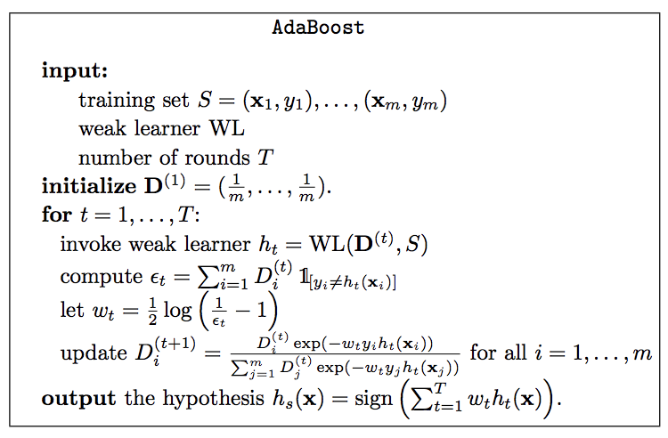

## Boosting

Boosting is an algorithmic paradigm that grew out of a theoretical question and
became a very practical machine learning tool. The boosting approach uses a
generalization of linear predictors to address two major issues:

- **Bias-complexity tradeoff**  
  Large H $\rightarrow$ small approximation, but large estimation error

- **Computational complexity**  
  ERM for learning halfspaces NP-Hard (under 0-1 loss)
  
  
A boosting algorithm amplifies the accuracy of weak learners. Intuitively, one can think of
a weak learner as an algorithm that uses a simple "rule of thumb" to output a
hypothesis that comes from an easy-to-learn hypothesis class and performs just
slightly better than a random guess. When a weak learner can be implemented
efficiently, boosting provides a tool for aggregating such weak hypotheses to
approximate gradually good predictors for larger, and harder to learn, classes.

### Weak learnability

> **Weak learnability**
> 
> A learning algorithm A is a $\gamma$-weak learner for a hypothesis class H
if there exists a function: 

> $\hspace{1cm} m_h: (0,1)^2 \rightarrow \mathbb{N}$
>
> such that
>
> - for every $\delta$, $\epsilon \in (0,1)$
> - for every distribution $D$ over $X$ and
> - for every labeling function $f: X \rightarrow \{+1,-1\}$
> 
> if realizability holds w.r.t. D,H,f. Running A on a sample size $m \geq m_H(\delta)$ we have 
> 
> $D^m(S: L_{D,f}(A(S)) \leq 1/2 - \gamma ) \geq 1 - \delta $

This definition is almost identical to the definition of PAC learning, which
here we will call strong learning, with one crucial difference: Strong learnability
implies the ability to find an arbitrarily good classifier (with error rate at most for an arbitrarily small  > 0). In weak learnability, however, we only need to
output a hypothesis whose error rate is at most 1/2 − $\gamma$, namely, whose error
rate is slightly better than what a random labeling would give us. The hope is
that it may be easier that it may be easier to come up with efficient weak learners than with efficient (full) PAC learners.

We call the hypothesis class from wich we select the $\gamma$-weak learner from the "base class" B.

### AdaBoost

The AdaBoost algorithm outputs a hypothesis that is a linear combination of simple hypotheses. In other words, AdaBoost relies on the family of hypothesis classes obtained by composing a linear predictor on top of simple classes. We will show that AdaBoost enables
us to control the tradeoff between the approximation and estimation errors by
varying a single parameter.

> **Theorem**
> 
> The empirical error of the hypothesis g returned by AdaBoost after T rounds of boosting is bound by $L_S(g) \leq e^{-2 \sum_{t=1}^T (1/2 - \epsilon_t)^2}$ with $\epsilon_t$ being the empirical error of $h_t$, that is the hypothesis selected in the t-th round.
> 
> If $\forall t \in \{ 1,..., T\}$, $\mu \in \{ 1/2 - \epsilon_t \}$ then $L_S(g) \leq e^{-2\mu^2T}$.

**Proof:**

We want to show that $L_S(g) \leq e^{-2 \sum_{t=1}^T (1/2 - \epsilon_t)^2}$

We know from the AdaBoost algorithm that:

$\epsilon_t = \sum_{i=1}^m D_t(i) \cdot 1_{y_i \neq h_t(x)}$

$D_{t+1}(i) = \frac{D_t(i) \cdot e^{-\alpha_t \cdot y_i \cdot h_t(x_i)}}{\sum_{j=1}^m D_t(j) \cdot e^{-\alpha_t \cdot y_i \cdot h_t(x_j)}} \hspace{1cm} \forall i \in \{ 1,..., m \}$

(1) Let's rewrite the empirical error:

$L_S(g) = \frac{1}{m} \sum_{i=1}^m 1_{g(x_i) \neq y_i} = \frac{1}{m} \sum_{i=1}^m 1_{y_i \cdot g(x_i) < 0} \leq \frac{1}{m} \sum_{i=1}^m e^{-y_i \cdot g(x_i)}$

(2) Let's call ...

$Z_t = \sum_{i=1}^m D_t(i) \cdot e^{-\alpha_t y_i h_t(x_i)}$

(3) Let's take a look at $D_{t+1}(i)$

$D_{t+1}(i) = \frac{D_t(i) \cdot e^{-\alpha_t \cdot y_i \cdot h_t(x_i)}}{\sum_{j=1}^m D_t(j) \cdot e^{-\alpha_t \cdot y_i \cdot h_t(x_j)}} = \frac{D_t(i) \cdot e^{-\alpha_t \cdot y_i \cdot h_t(x_i)}}{Z_t}$

$ = \frac{D_{t-1}(i) \cdot e^{-\alpha_{t-1} \cdot y_i \cdot h_{t-1}(x_i)} \cdot e^{-\alpha_t \cdot y_i \cdot h_t(x_i)}}{Z_{t-1} \cdot Z_t} = \frac{\prod_{s=1}^t e^{-\alpha_s \cdot y_i \cdot h_s(x_i)}}{m \cdot \prod_{s=1}^t Z_s}$

$= \frac{e^{-y_i \cdot \sum_{s=1}^t \alpha_s \cdot h_s(x_i)}}{m \cdot \prod_{s=1}^t Z_s}$

Since $g(x_i) = \sum_{s=1}^t \alpha_s \cdot h_s(x_i)$ we can say:

$\frac{e^{-y_i \cdot \sum_{s=1}^t \alpha_s \cdot h_s(x_i)}}{m \cdot \prod_{s=1}^t Z_s} = \frac{e^{-y_i g(x_i)}}{m \cdot \prod_{s=1}^t Z_s} = D_{t+1}$

(4) Combine (1) and (3)

$L_S(g) \leq \frac{1}{m} \sum_{i=1}^m e^{-y_i g(x_i)}$

$= \frac{1}{m} \sum_{i=1}^m [m \prod_{s=1}^T Z_s] \cdot D_{T+1}(i)$

$= \prod_{s=1}^m Z_s \cdot \sum_{i=1}^m D_{T+1}(i) = \prod_{s=1}^T Z_s$

(5) ...

To be continued ...

### VC-Dim of AdaBoost

Skip proof