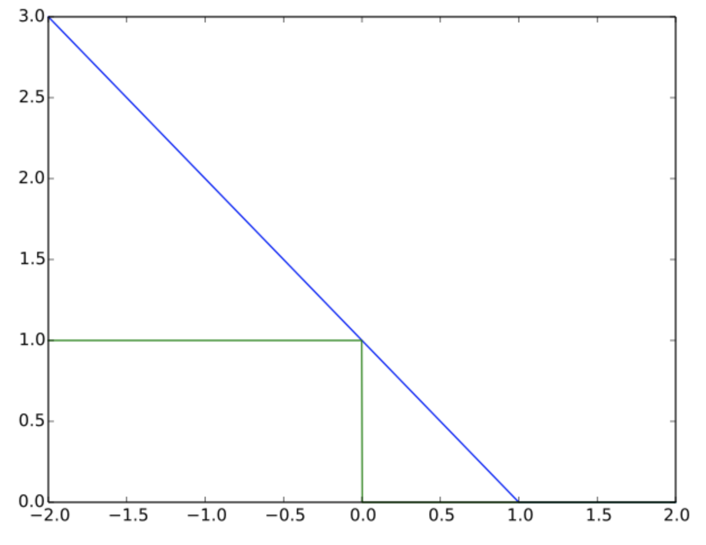
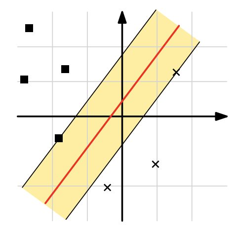
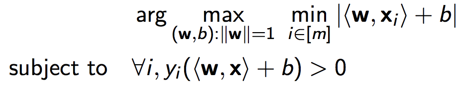
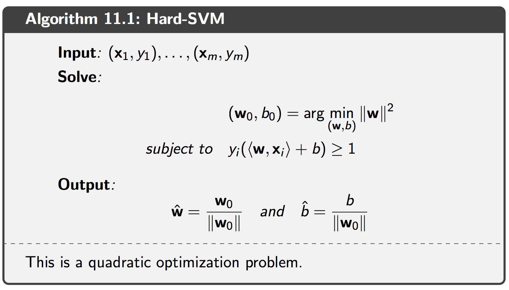
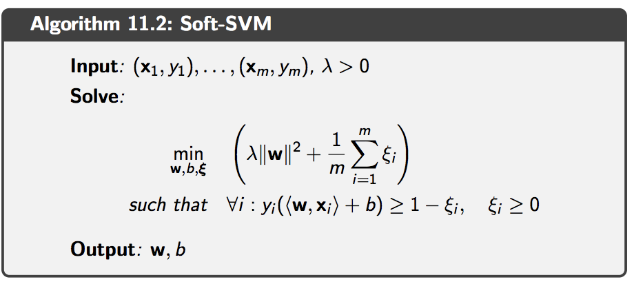
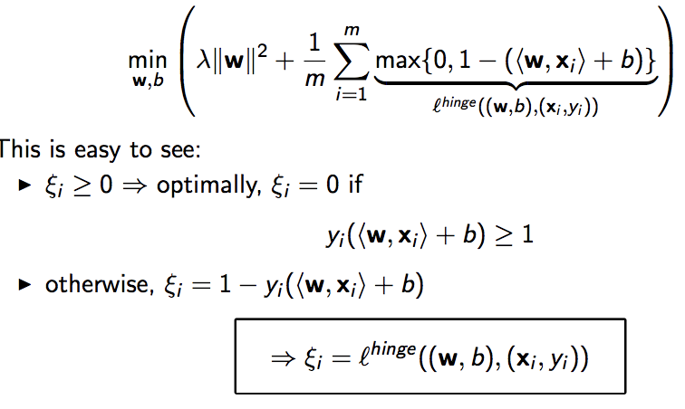

## Support Vector Machines (SVM)

The support vector machine paradigm (SVM) for learning linear predictors in high
dimensional feature spaces. The high dimensionality of the feature space raises
both sample complexity and computational complexity challenges.  
The SVM algorithmic paradigm tackles the sample complexity challenge by
searching for "large margin" separators. Roughly speaking, a halfspace separates
a training set with a large margin if all the examples are not only on the correct
side of the separating hyperplane but also far away from it. Restricting the
algorithm to output a large margin separator can yield a small sample complexity
even if the dimensionality of the feature space is high (and even infinite). We
introduce the concept of margin and relate it to the regularized loss minimization
paradigm as well as to the convergence rate of the Perceptron algorithm.

### Surrogate loss function

For computational efficiency we wish to work wish a convex loss function.

A function $l((w,b),z)$ is a surrogate loss if

- $\forall \text{ w,b,z}: l((w,b),z) \geq l^{0-1}((w,b), z)$
- $\forall (x,y): l(\cdot,(x,y))$ is a convex function

### Hinge loss

One well-known surrogate loss function is the **hinge-loss**.

$l^{hinge}((w,b),x) = max\{0,1-y(<w,x>+b)\}$ where $=\{1,-1\}$

So, let's compare the output of the Hinge loss to the 0-1 loss.

**Hinge loss:**  
- Correct classification: $l^{hinge}((w,b),x)$ = 0  
- Wrong classification: $l^{hinge}((w,b),x) \geq 1$

**0-1 Loss:**  
- Correct classification: 0  
- Wrong classification: 1

So we can say that the Hinge loss upper-bounds the 0-1 loss.

### Margin in SVMs

We've already shown that a PAC learnable problem can be solved by a halfspace classifier. However, there's typically not just one hyperplane that separates the data perfectly. So, the question which remains is which hyperplanes solved our problem best.

SVM tries to tackle this problem by adding and maximizing a margin to the hyperplane.

We consider the margin as the **minimum distance between a point and a line**.

Hyperplane: $u(x) = <w,x> + b$  
Point: $p = (x_p,y_p)$

Distances between $p$ and all points on the hyperplane:

$\{||p-u||: <w,x> + b = 0\}$

Minimum distance between $p$ and the hyperplane:

min \{$||p-u||: <w,x> + b = 0 \}$

We can show that the minimum distance between a point and a hyperplane can be calculated by the following equation (assuming $|w|=1$):

$|<w,p>+b|$

**Proof:**

*The distance between a point $x \in R^d$ and the hyperplane defined by
$(w,b)$ where $|w| = 1$ is $|<w,x> + b|$.*

In other words, we want to show that

$d(L,x) = min \{ || x - v ||: <w,v> + b = 0 \}$

We are going to split the proof in two parts:

1. Show that $|| x - v ||$ is indeed on the hyperplane
2. Show that $|| x - v ||$ is the closest point

**1. Part**

(1) Project x onto w

$(<w,x>+b) \cdot \frac{w}{||w||}$

However, since $||w|| = 1$ we get: $(<w,x>+b) \cdot w$

(2) Compute vector v to point on hyperplane

$v = x - (<w,x>+b) \cdot w$

(3) Show that v is on the hyperplane (remember $||w|| = 1$)

$<w,v> + b = <w, x - (<w,x>+b) \cdot w> + b ) = <w,x> - ||w||^2 \cdot (<w,x>+b)+b$

$ = <w,x> - <w,x> -b + b = 0$

**2. Part**

(1) Compute distance to hyperplane

$||x-v|| = || x - (x - (<w,x>+b) \cdot w) || = || (<w,x>+b) \cdot w) ||$

$= |<w,x>+b| \cdot ||w||$

Since $||w|| = 1$: 

$= |<w,x>+b|$

**Hence, we know that the distance is at most $|<w,x>+b|$.**

(2) Show that any other point $u$ on the hyperplane is at least $||x − v||$ away

$||x-u|| = ||x - v + v - u|| = ||x-v||^2 + ||x-u||^2 + 2<x-v,v-u>$

$\geq  ||x-v||^2 + 2<x-v,v-u>$

$= ||x-v||^2 - 2(<w,x> +b )<w,v-u>$

$= ||x-v||^2$ (since $<w,u> = <w,v> = -b$)

**The hyperplane is at least $||x-v||$ away.**

### Analyzing the hinge loss

Now, let's take a closer look at the output of the hinge loss function to understand how different points get penalized.

$l^{hinge}((w,b),x) = max\{0,1-y(<w,x>+b)\}$ where $=\{1,-1\}$
 
- **Point gets classified correctly (Distance to hyperplane > 1)**  
  Hinge loss becomes 0
- **Point gets classified correctly (Distance to hyperplane < 1)**  
  Dependent on the distance we have to "pay" something between 0-1.
- **Point gets classified wrongly**  
  We "pay" dependent on the distance

This also means that we don't really maximize the margin. We just try to make sure that the points are at least 1 away from the hyperplane.

### Hard SVM

Hard-SVM is the learning rule in which we return the ERM hyperplane
that separates the training set with the largest possible margin.

Formally, this corresponds to the following optimization problem:

### Soft-SVM and Norm Regularization

The Hard-SVM formulation assumes that the training set is linearly separable, which is a rather strong assumption. Soft-SVM can be viewed as a relaxation of the Hard-SVM rule that can be applied even if the training set is not linearly separable.

In Soft SVM we relax the separability assumption of Hard-SVM:

$\forall i: y_i(<w,x_i>+b) \geq 1$ to $\forall i: y_i(<w,x_i>+b) \geq 1 - \xi_i$

with $\xi_i \geq 0$ referred as *slack variable*. In fact, $\xi_i$ measures how much the constraint $y_i(<w,x_i>+b) \geq 1$ is violated.

A closer look reveals that the Soft-SVM problem is equivalent to the RLM problem:

### Appendix: Projecting a vector onto a vector

Let's assume that we have two vectors $a$, $b$ and we want to project the vector $a$ onto the vector $b$.

First, we should recall the geometric definition of the dot product.

$<a,b> = ||a|| \cdot ||b|| \cdot cos(\phi)$

(1) Compute length of $||b||$

$cos(\phi) = \frac{||b_{proj}||}{||a||}$

$||b_{proj}|| = ||a|| \cdot cos(\phi)$

(2) Rewrite it using dot product

$||b_{proj}|| = ||a|| \cdot cos(\phi) = ||a|| \cdot cos(\phi) \cdot \frac{||b||}{||b||} = \frac{<a,b>}{||b||}$

(3) Transform distance into vector

$b_{proj} = \frac{<a,b>}{||b||} \cdot \frac{b}{||b||} = \frac{<a,b> b}{||b||^2}$

